# POS user guide

This guide is for the shop owner and the cashiers. It covers installing the app, selling, and keeping the data safe. Screenshots come from the app itself.

## 1. Install

1. Open https://github.com/zawibuttar/POS/releases on the shop computer.
2. Download `POS-<version>-setup.exe` (Windows) or `POS-<version>.dmg` (Mac) from the latest release.
3. Run it. On Windows choose the install folder if you like, then finish. A **POS** shortcut appears on the desktop.

The app works without internet. Internet is only used for Google backup and for updates.

## 2. First run

The first time the app opens it asks four things.

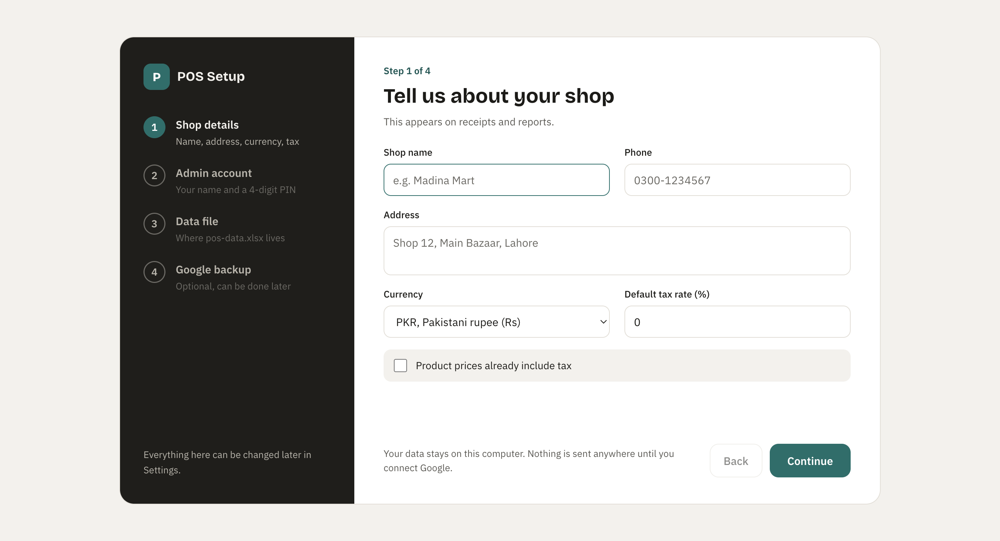

1. **Shop details**: name, phone and address. These print on receipts and can be changed later in Settings.
2. **Admin account**: your name and a 4-digit PIN. The admin PIN protects refunds, settings and data tools. Keep it private.
3. **Data folder**: where `pos-data.xlsx` lives. Keep the default, which is on this computer. Do not put it on a network drive or a folder synced by another tool.
4. **Google backup**: skip for now, you can connect it later in Settings.

## 3. Sign in

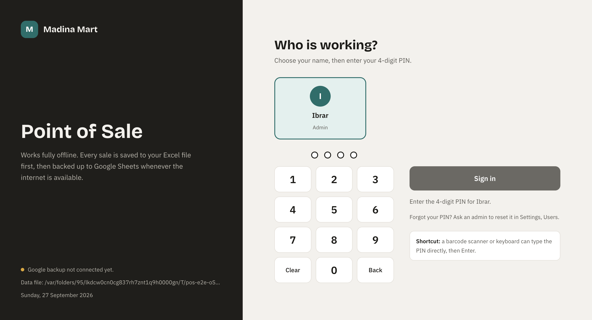

Tap your name, then type your PIN on the keypad or the keyboard. Five wrong PINs in a row lock that account for 30 seconds. After that only two more tries are allowed before the next lock, and each lock lasts twice as long as the one before, up to 15 minutes. Restarting the app does not clear a lock. The admin PIN asked for refunds, restores and archives follows the same rule. Forgotten PINs are reset by an admin in Settings › Users and PINs.

The app returns to this screen on its own after a period of no activity (10 minutes by default, see section 12).

## 4. The register

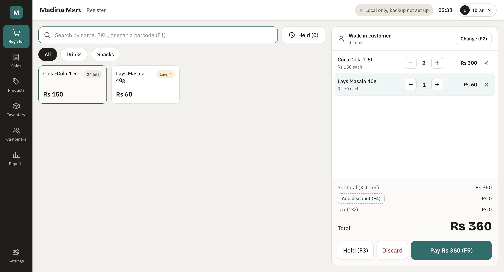

- **Find a product**: type part of the name or SKU in the search box, or scan a barcode. A scanned barcode adds the product straight to the cart. Press **F1** to jump to the search box.
- **Category chips** under the search box filter the grid.
- **Cart**: tap a line to select it, use plus and minus to change the quantity, or the cross to remove it. The cart shows subtotal, discount, tax and total.
- **Customer**: press **F2** or "Change" to attach a customer. Needed for credit sales.
- **Discount**: press **F4** to give a percentage or amount off the whole sale.
- **Hold**: press **F3** to park the sale and serve someone else. Held sales survive a restart. "Held (n)" opens the list to resume one. A resumed sale uses today's prices, and any item that is no longer for sale is left out with a message.
- **Discard** empties the cart.

## 5. Taking payment

Press **F9** or "Pay".

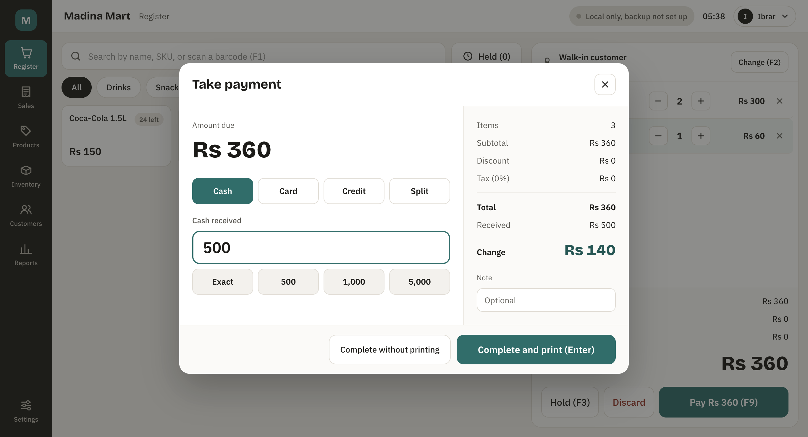

- **Cash**: type the cash received, or tap a quick amount. The change is shown large.
- **Card**: optionally note the last digits or a reference.
- **Credit**: adds the amount to the customer's balance. If the sale would take the customer over their credit limit, the dialog asks for the admin PIN before it can be completed.
- **Split**: any mix of cash, card and credit.

"Complete and print" saves the sale and prints the receipt. "Complete without printing" saves only. Every sale is written to `pos-data.xlsx` before the success screen appears.

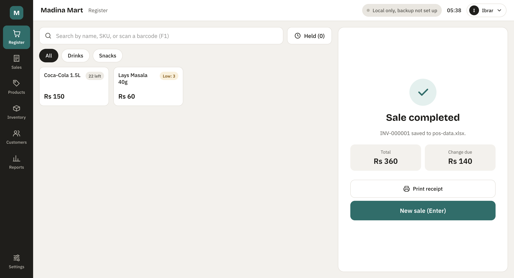

Press **Enter** for the next sale, or reprint the receipt.

## 6. Sales history and refunds

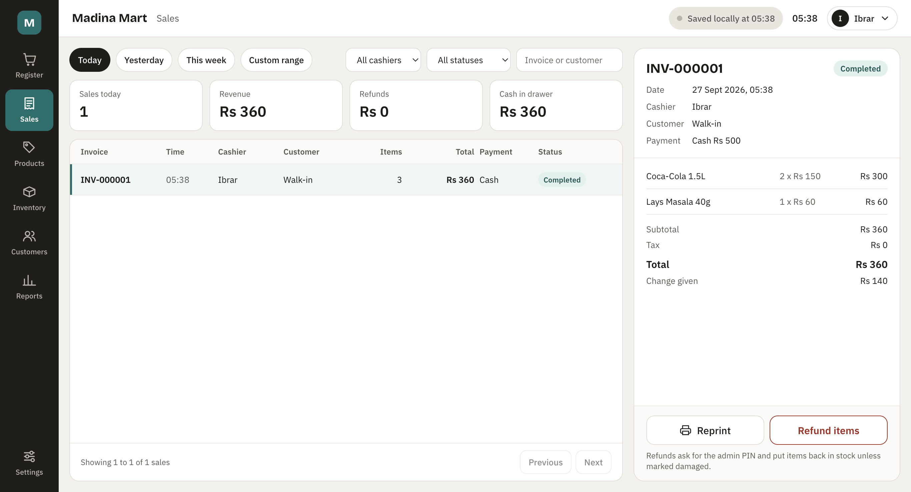

The Sales screen lists every sale with a search box, date range and status filter. Select a sale to see the items, payments and a receipt preview, and to reprint it.

**Refunds** are behind the admin PIN. Choose the items and quantities to refund, whether to put them back in stock, and how the money goes back (cash, card or customer credit). The amount is each item's share of what the customer actually paid, so discounts and tax are handled for you. Cash or card can only be refunded up to the cash or card received for that sale; the part that was put on credit goes back to the customer's credit, which the dialog selects by default for credit sales. Sales in an archived year (section 13) can be viewed and reprinted but not refunded.

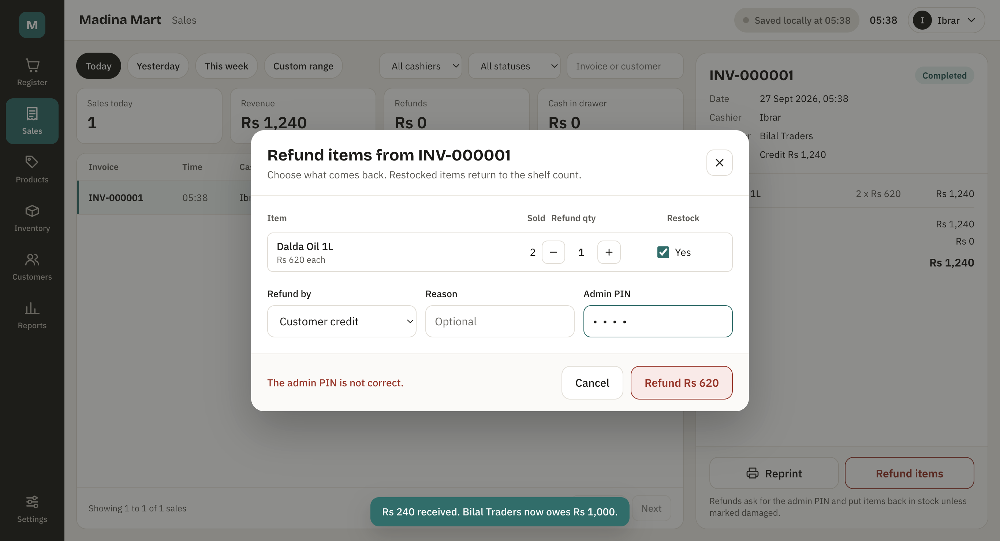

## 7. Products

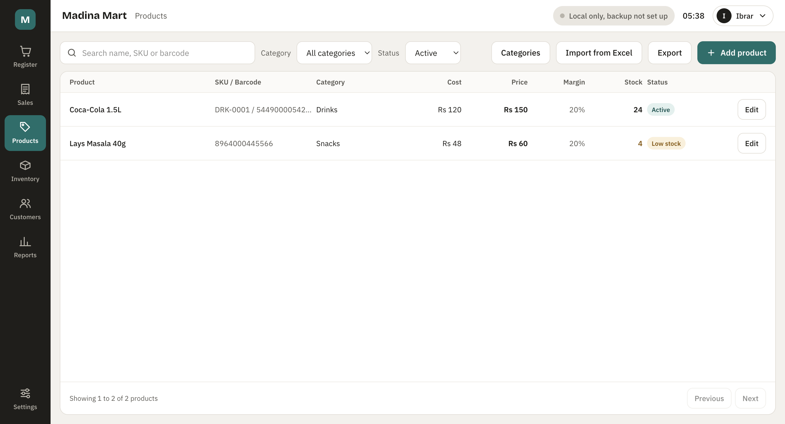

Admins add and edit products: name, barcode, SKU, category, cost, sale price, tax, unit, opening stock and low-stock level. The margin is shown as you type. Products can be marked inactive instead of deleted, so old sales keep their history.

**Import from Excel or CSV**: "Import" opens a preview that maps columns, shows problems per row and creates or updates products in one go. Use "Download template" for the expected columns.

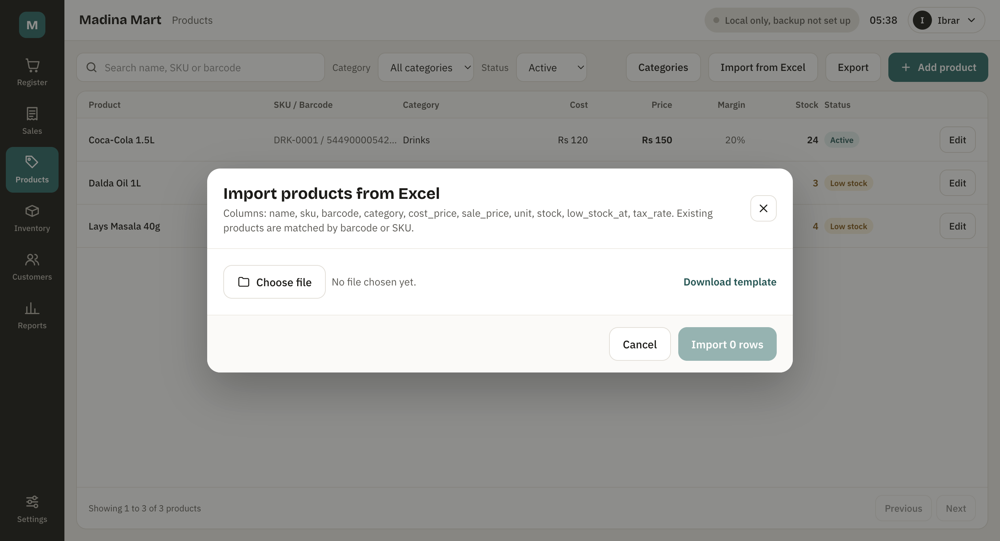

## 8. Inventory

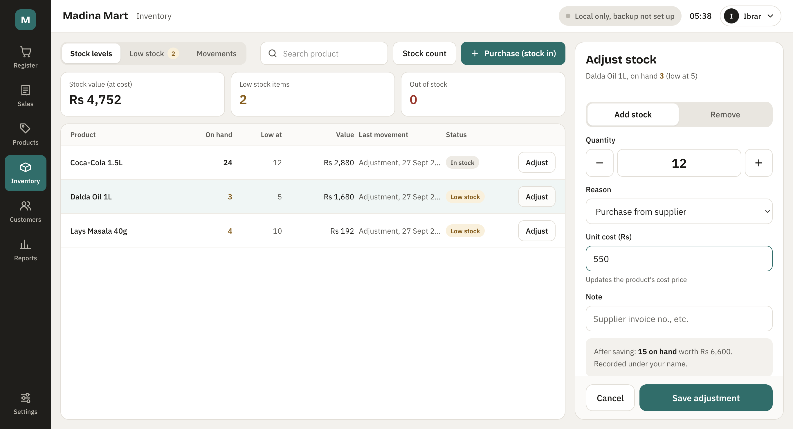

Record purchases, adjust counts and see the low-stock list. Every change, including sales and refunds, appears in the movement history with who did it and when.

## 9. Customers and credit

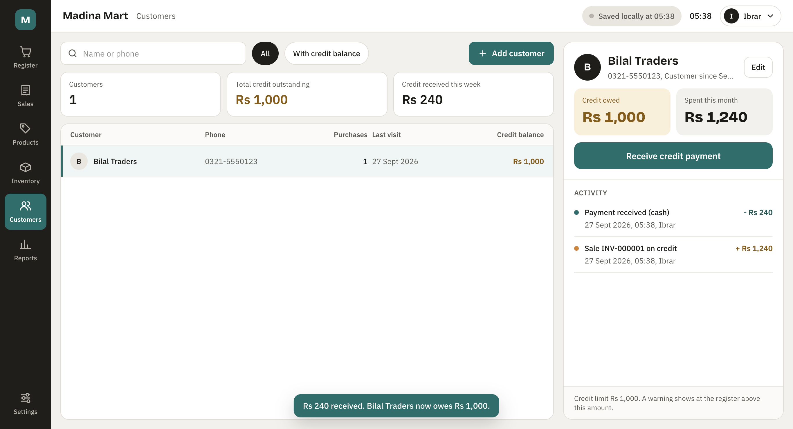

Add customers with a phone number and an optional credit limit. Only an admin can set or change the limit; cashiers can add customers, attach them to sales and receive payments. The customer page shows the balance, credit sales and payments. "Receive credit payment" records money paid against the balance.

## 10. Reports

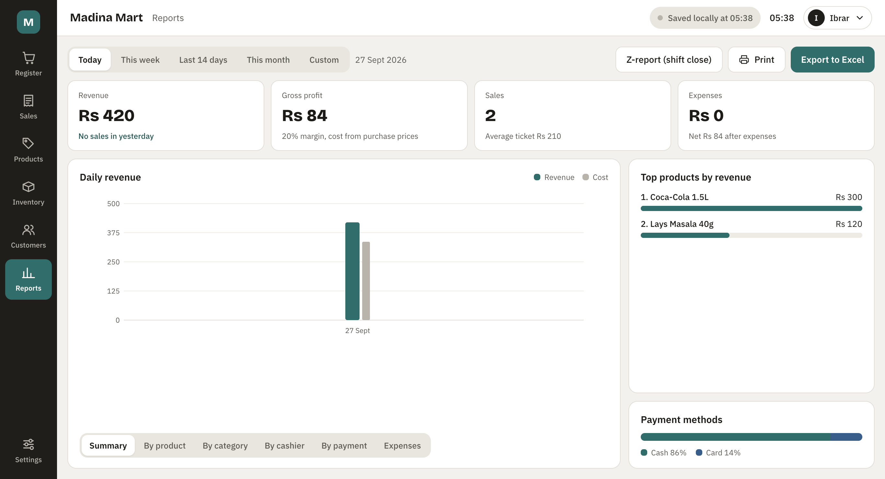

Admins see revenue, profit, refunds, average ticket, top products and payment mix for any date range. Tabs break the range down by product, category, cashier, payment method, hour and day. Any table can be exported to Excel.

**Expenses** are recorded here too and give the "net after expenses" figure.

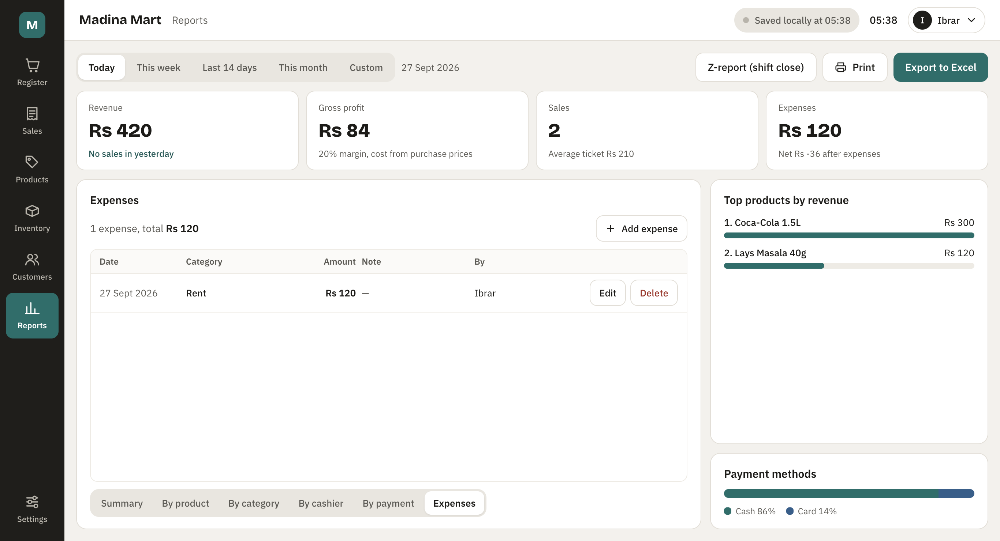

**Z-report** closes a shift: it shows sales by payment method, refunds, expenses paid in cash and the expected cash in the drawer, and can be printed.

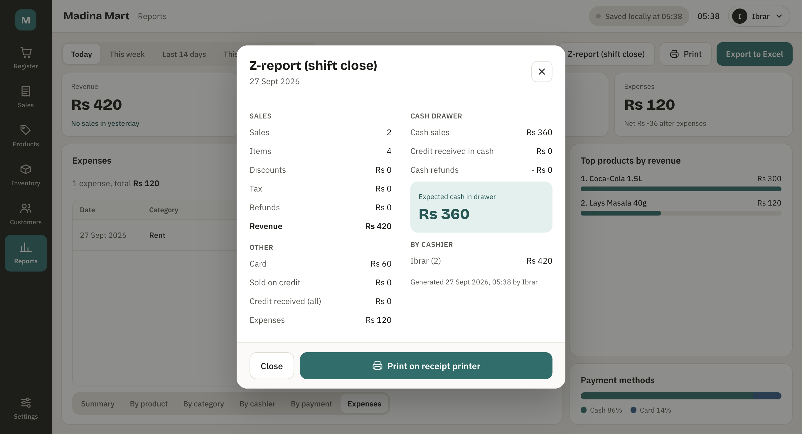

## 11. Settings

Settings are for admins only.

### Shop

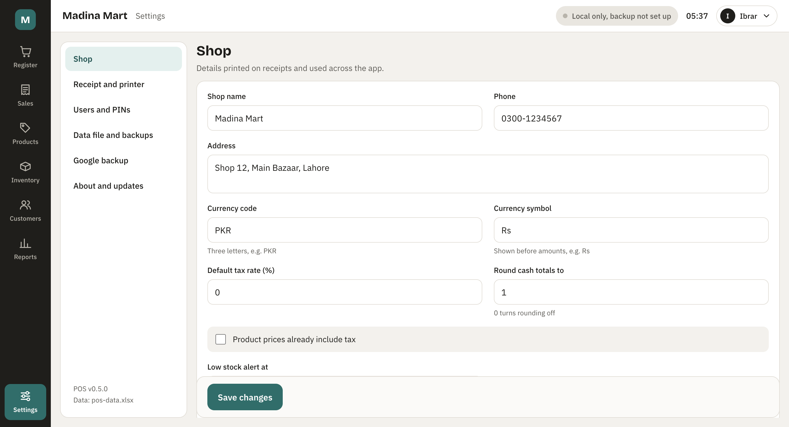

Shop name, phone, address, currency, tax rate, cash rounding, low-stock default and whether selling below zero stock is allowed.

### Receipt and printer

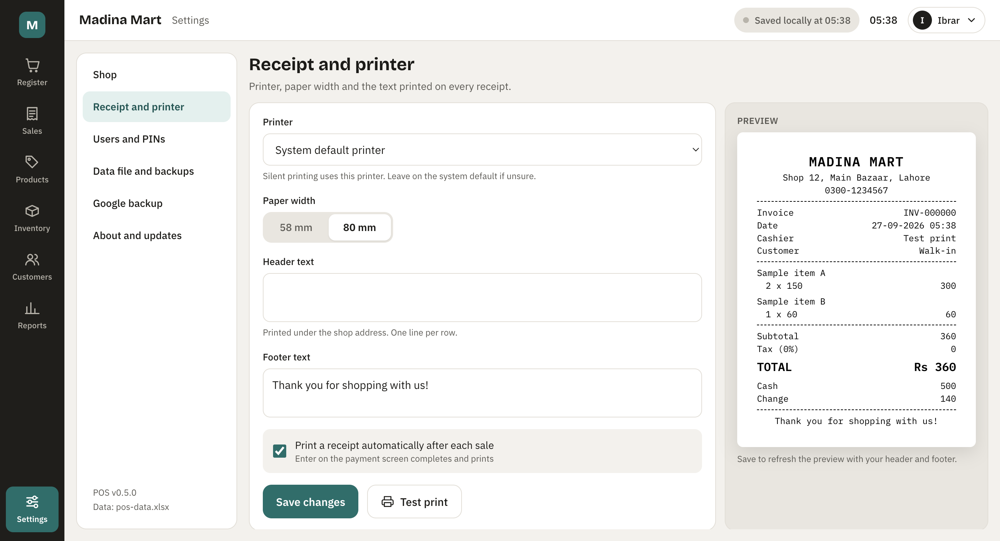

Paper width (58 or 80 mm), header and footer lines, whether to show the cashier and barcode, which printer to use and a test print. The preview updates as you type.

### Users and PINs

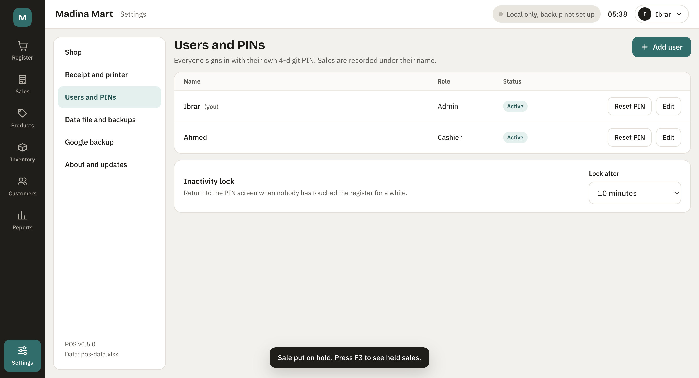

Add cashiers, set roles, reset PINs and deactivate people who leave. Cashiers cannot open Products, Inventory, Reports or Settings. The inactivity lock time is set here. A user shown as **No PIN** (for example after restoring a backup on a new computer) cannot sign in until you reset their PIN.

### Data file and backups

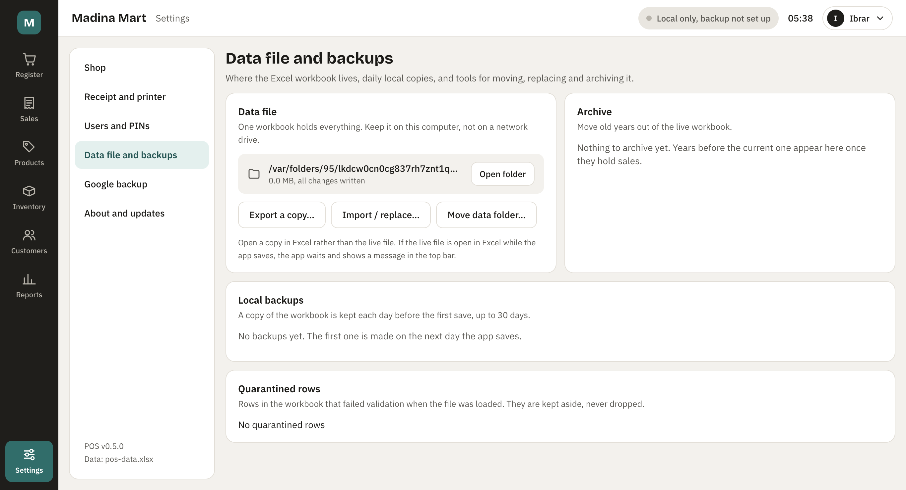

See section 13.

### Google backup

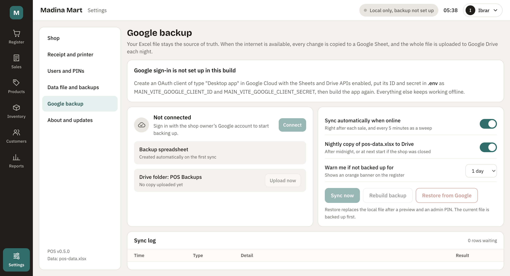

See section 14.

### About and updates

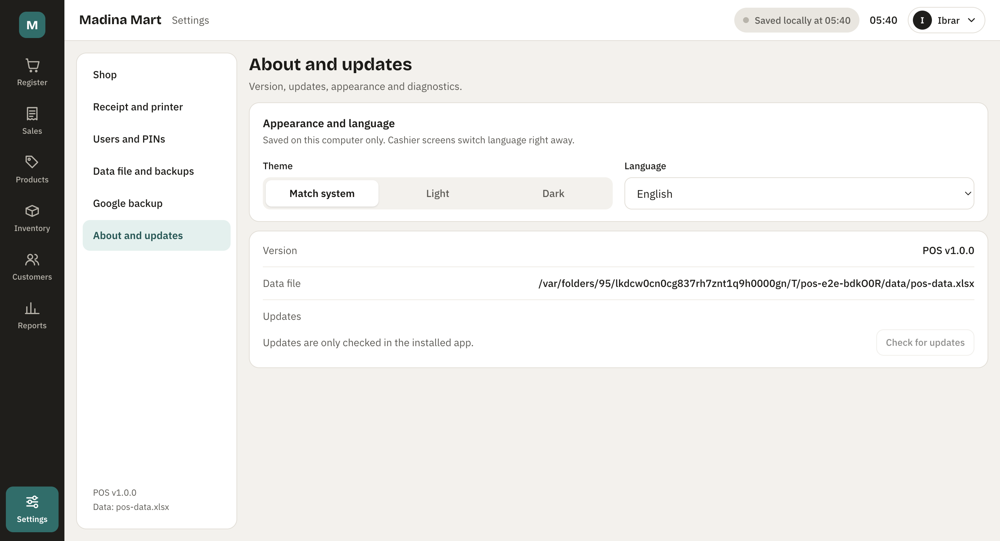

Version, update status, theme and language.

## 12. Appearance and language

In Settings › About and updates choose **Light**, **Dark** or **Match system**. The choice is saved on this computer.

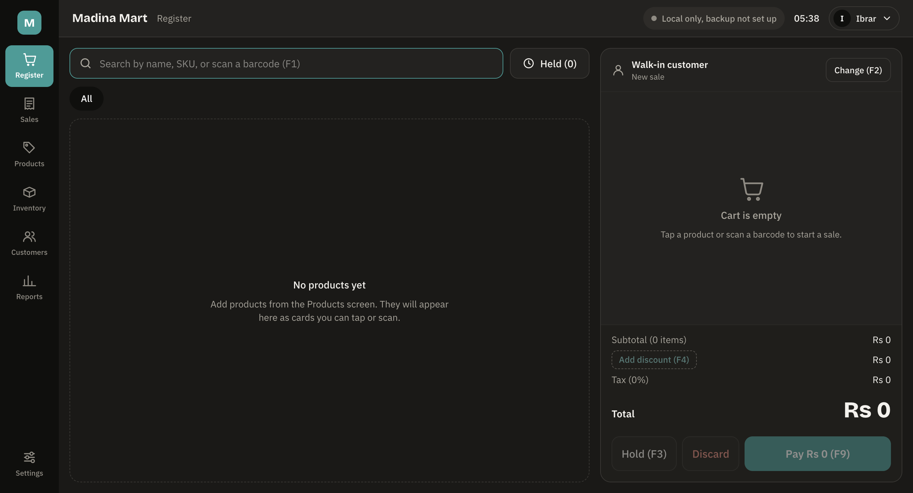

The language list has English and a partial Urdu translation for the cashier screens. Urdu switches the layout to right-to-left.

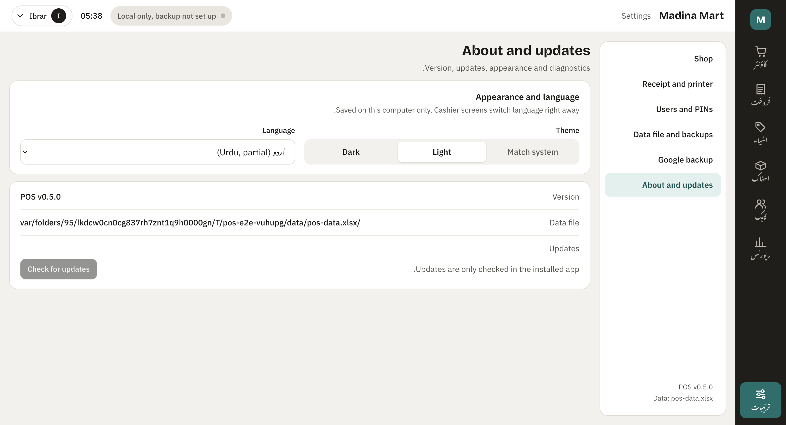

## 13. Keeping the data safe

Everything lives in one Excel workbook, `pos-data.xlsx`, in the data folder chosen at setup. You can open it in Excel to look at the sheets, but prefer **Export a copy** and open the copy. Exported copies, Google Sheets and Drive backups never contain PINs; those stay on the shop computer only.

**What the app does on its own**

- Writes every change to a journal first, then rewrites the workbook. If the computer loses power mid-sale, the sale is recovered on the next start.
- Keeps one backup per day in the `backups` folder (30 days).
- Sets aside rows it cannot read into a quarantine list instead of dropping them.

**If the file is open in Excel** while the app saves, the top bar shows "Close pos-data.xlsx in Excel to save". The app keeps retrying. Close the file in Excel and the save goes through.

**If the file is changed outside the app**, a banner appears:

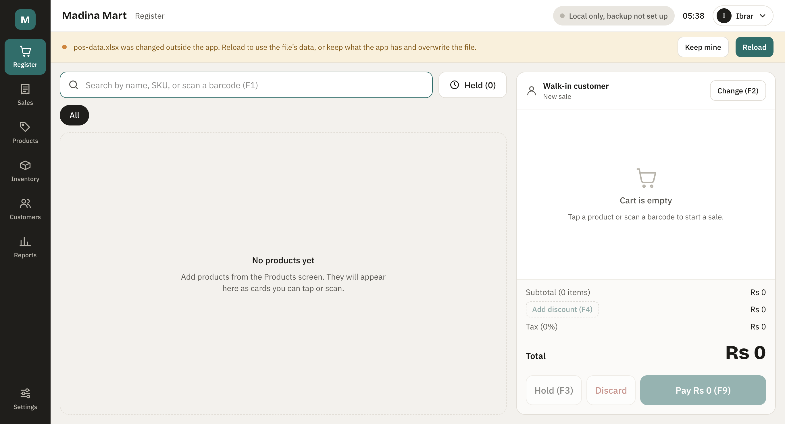

- **Reload** reads the file again and then re-applies anything the app had not yet saved, so a sale made a moment ago is not lost.
- **Keep mine** rewrites the file with the app's data.

**Settings › Data file and backups** offers:

- **Open folder**: shows the data folder in Explorer or Finder.
- **Export a copy**: saves a copy of the workbook wherever you choose.
- **Import / replace**: replaces the live data with another POS workbook after a preview of valid and invalid rows. Needs the admin PIN. The current file is copied to backups first.
- **Move data folder**: copies the workbook, journal and backups to a new folder and switches to it.
- **Local backups**: list of daily copies with **Restore** (admin PIN, preview first). Restoring keeps the PINs already on this computer; users that only exist in the backup show as **No PIN** until an admin resets them.
- **Archive year**: moves sales, payments, refunds, stock movements, credit payments and expenses of a past year into `pos-archive-YYYY.xlsx`, keeping the live file small and fast. Archived sales still appear in reports, the Sales screen and reprints, but they cannot be refunded any more, and a sale whose refund happened in a later year stays in the live file until that year is archived too.
- **Quarantined rows**: shows rows that failed validation and lets you clear the list once they are dealt with.

## 14. Google backup

Google backup mirrors every sheet to a Google Spreadsheet as soon as the computer is online, and copies the workbook to Google Drive every night (keeping the last seven). The Google sign-in only asks for permission to files the app creates itself, plus your email address. Drive copies are named with the shop name and a short code for this computer, so two terminals on one Google account keep separate copies.

1. In Settings › Google backup press **Connect Google** and sign in with the shop's Google account in the browser that opens.
2. The app creates a spreadsheet named after the shop. "Open spreadsheet" shows it.
3. The **sync pill** in the top bar tells you the state: local only, offline with N waiting, syncing, online and synced, or reconnect needed.

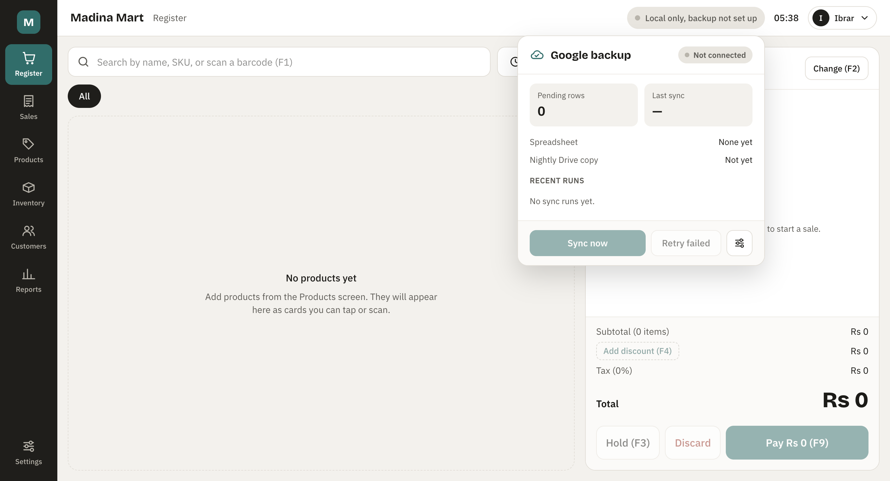

**Restore from Google** (new computer or lost file): connect the same Google account, then choose "Restore from Google Sheets" or a Drive copy. Always run the preview first; it shows how many rows are valid and refuses to restore an empty spreadsheet. The restore uses exactly the rows you previewed (within ten minutes), asks for the admin PIN, backs up the current file and replaces it. Staff other than the admin who restored will show as **No PIN** afterwards; reset their PINs in Settings › Users and PINs.

## 15. Updates

The installed app checks GitHub for a new version shortly after starting and every few hours. When one exists, Settings › About shows **Download version X**; press it when the shop is quiet. Once downloaded, a small **Update ready** box appears; press **Restart now** or let it install at the next start.

## 16. Keyboard shortcuts

| Key              | Where          | Action                      |
| ---------------- | -------------- | --------------------------- |
| F1               | Register       | Focus search / scan box     |
| F2               | Register       | Choose customer             |
| F3               | Register       | Hold sale / show held sales |
| F4               | Register       | Discount                    |
| F9               | Register       | Pay                         |
| Enter            | Pay dialog     | Complete and print          |
| Enter            | Success screen | New sale                    |
| Escape           | Any dialog     | Close                       |
| Digits and Enter | Login          | Type the PIN                |

## 17. If something goes wrong

- **"POS is already open" at startup** but no other window is open: the previous run did not close cleanly. Choose **Open anyway**. If another computer really has the file open, choose Quit and close it there first.

- **The app shows "Something went wrong on this screen"**: press **Copy diagnostics**, paste it into a message to support, then **Reload app**. No data is lost.
- **A sale seems missing**: open Sales and clear the filters. If the file was restored from a backup, sales after that backup are in the newer backups in the `backups` folder.
- **The register is slow with a very large file**: archive past years in Settings › Data.
- **Logs**: the `logs` folder next to the app's settings holds `main.log`. On Windows it is under `%APPDATA%\pos\logs`.
